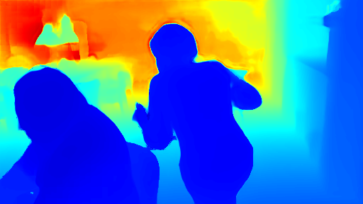

<div align="center">
<h1>测试 （CVPR 2025）MonST3R: A Simple Approach for Estimating Geometry in the Presence of Motion</h1>
</div>

## 配置测试

首先安装一系列的依赖项

```bash
git clone --recursive https://github.com/KwanWaiPang/monst3r.git
 
# rm -rf .git

conda create -n monst3r python=3.11 cmake=3.14.0
conda activate monst3r 
# conda remove --name monst3r --all

#A100用的就是CUDA12.2，应该是可以兼容的
pip install torch==2.5.0 torchvision==0.20.0 torchaudio==2.5.0 --index-url https://download.pytorch.org/whl/cu121
# conda install pytorch torchvision pytorch-cuda=12.1 -c pytorch -c nvidia  # use the correct version of cuda for your system
pip install -r requirements.txt

# 额外单独安装
# pip install -e third_party/sam2
cd /home/gwp/monst3r/third_party/sam2
# 清理之前的构建缓存
rm -rf build/ dist/ *.egg-info/
python setup.py build_ext --inplace
python setup.py install --user

# 可视化相关依赖，
pip install -r requirements_optional.txt

# 额外单独安装
pip install waymo-open-dataset-tf-2-12-0 --no-deps

```

然后安装4d的可视化工具

```bash
pip install -e viser
```

安装RoPE 的cuda kernal

```bash
# DUST3R relies on RoPE positional embeddings for which you can compile some cuda kernels for faster runtime.
cd croco/models/curope/
python setup.py build_ext --inplace
cd ../../../
```

然后下载MonST3R，光流及语义三个模型的权重

```bash
# pip install gdown 
# gdown https://drive.google.com/uc?id=标识符
# conda activate monst3r
# gdown https://drive.google.com/uc?id=1Z1jO_JmfZj0z3bgMvCwqfUhyZ1bIbc9E

# download the weights
cd data
bash download_ckpt.sh
cd ..
```

下载数据集

```bash
cd data; python download_davis.py; cd ..
```

不过项目本身给了lady-running数据，下面先以其为例

```bash
python demo.py # launch GUI, input can be a folder or a video
# use memory efficient optimization: --not_batchify

# 用MobaXterm 来可视化
conda activate monst3r 
CUDA_VISIBLE_DEVICES=3 python demo.py --input demo_data/lady-running --output_dir demo_tmp --seq_name lady-running
# use video as input: --input demo_data/lady-running.mp4 --num_frames 65
# (update 12/15) use memory efficient optimization: --not_batchify
# (update 1/20) use real-time mode: --real_time
```

* 结果会存放在demo_tmp路径下。`The results will be saved in the demo_tmp/{Sequence Name} (by default is demo_tmp/NULL) folder for future visualization.`
* 推理的结果似乎很久，并且很容易out of memory

输入序列

<div align="center">
<video playsinline autoplay loop muted src="./demo_data/lady-running.mp4" poster="https://kwanwaipang.github.io/File/Representative_works/loading-icon.gif" alt="sym" width="80%" style="padding-top:0px;padding-bottom:0px;border-radius:15px;"></video>
</div>

估算出来的深度结果如下图所示

<div align="center">
  
<figcaption>  
</figcaption>
</div>


可视化4D结果，在vscode下运行即可打开浏览器~

```bash
python viser/visualizer_monst3r.py --data demo_tmp/lady-running
# to remove the floaters of foreground: --init_conf --fg_conf_thre 1.0 (thre can be adjusted)

# 下面是实时可视化(但是似乎运行不成功，难道是实测的时候用的？)
# (update 1/20) for results generated by real-time mode, please (update viser and) using the following command: 
python viser/visualizer_monst3r_realtime.py --data-path demo_tmp/lady-running
```

接下来验证其他序列看看效果

```bash
CUDA_VISIBLE_DEVICES=3 python demo.py --input data/davis_videos/breakdance.mp4 --output_dir demo_tmp --seq_name breakdance
python viser/visualizer_monst3r.py --data demo_tmp/breakdance


CUDA_VISIBLE_DEVICES=3 python demo.py --input data/davis_videos/judo.mp4 --output_dir demo_tmp --seq_name judo
python viser/visualizer_monst3r.py --data demo_tmp/judo
```


具体可视化效果请见博客中对4D场景进行可视化
